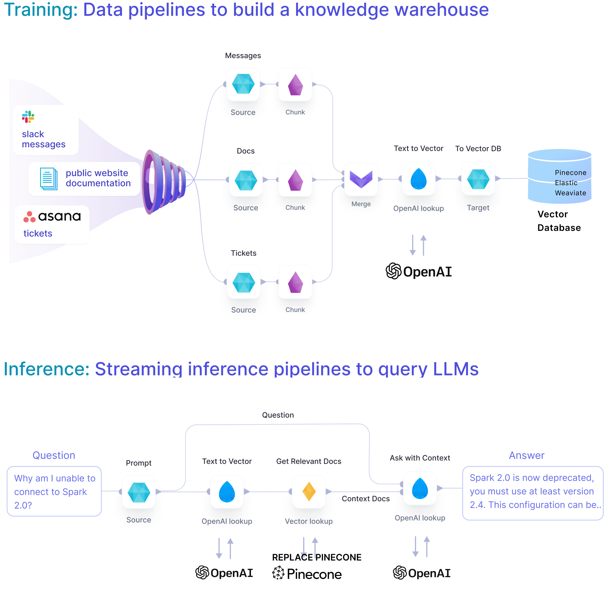

# Generative-AI Chatbot

This project showcases how easy it is to ingest unstructured data from your applications, pre-process & vectorize it and store within your vector database of choice. Based on those vectors it further builds a live chatbot application on Slack or Teams (coming soon).



## Requirements 

**External dependencies** (optional, but recommended for best results):

1. [**Pinecone**](https://www.pinecone.io/) - allows for efficient storage and retrieval of vectors. To simplify, it's possible to alternatively use Spark-ML cosine similarity - however, since that doesn't feature KNNs for more efficient lookup, it's only recommended for small datasets.
2. [**OpenAI**](https://openai.com/) - for creating text embeddings and formulating questions. Alternatively, one can use Spark's [word2vec](https://spark.apache.org/docs/2.2.0/mllib-feature-extraction.html#word2vec) for word embeddings and an [alternative LLM (e.g. Dolly)](https://github.com/prophecy-io/spark-ai/tree/main) for answer formulation based on context.
3. [**Slack**](https://slack.com/) or [**Teams**](https://teams.com/) (support coming soon) - for the chatbot interface. An example batch pipeline is present for fast debugging when that's not available.   

**Cluster dependencies** (required): 

1. [**Spark-AI**](https://github.com/prophecy-io/spark-ai/tree/main) - Toolbox for building Generative AI applications on top of Apache Spark.

**Platform recommendations:**

1. [**Prophecy Low-Code**](https://www.prophecy.io/) (version 3.1 and above) - for building the data pipelines, free account is available.
2. [**Databricks**](https://databricks.com/) (DBR 12.2 ML and above) - for running the data pipelines. Free community edition is available or Prophecy provides Databricks' free trial. 

## Getting started

1. Ensure that above dependencies are satisfied. Create appropriate accounts on the services you want to use above and install required dependencies on your Spark cluster.

   1. [Setup Slack application](https://api.slack.com/reference/manifests#creating_apps) using the manifest file in [apps/slack/manifest.yml](apps/slack/manifest.yaml).
   2. Generate App-Level Token with `connections:write` permission. This token is going to be used for receiving messages from Slack.
   3. Find the Bot User OAuth Token. This token is going to be used for sending messages to Slack.

   https://github.com/prophecy-samples/gen-ai-chatbot-template/assets/3248329/0a3f402e-612f-41b7-9fcd-934acebf4a02

2. Fork this repository to your personal GitHub account.


3. Load the forked repository into Prophecy account. 

    [gif here]


4. Configure the credentials to your Pinecone, OpenAI, Slack and/or Teams accounts on Databricks secrets. 
    [gif here]
    ```bash
    databricks secrets create-scope --scope slack
    databricks secrets put --scope slack --key app_token
    databricks secrets put --scope slack --key token
   
    databricks secrets create-scope --scope pinecone
    databricks secrets put --scope pincone --key api_key
   
    databricks secrets create-scope --scope openai
    databricks secrets put --scope openai --key token
    ```

5.  

